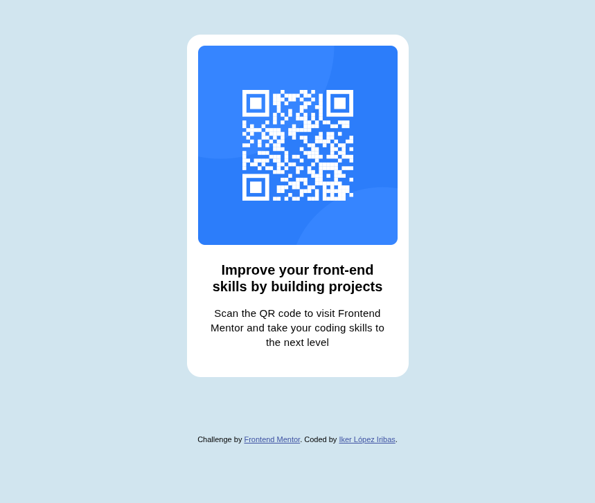

# Frontend Mentor - QR code component solution

This is a solution to the [QR code component challenge on Frontend Mentor](https://www.frontendmentor.io/challenges/qr-code-component-iux_sIO_H). Frontend Mentor challenges help you improve your coding skills by building realistic projects.

## Table of contents

- [Overview](#overview)
  - [Screenshot](#screenshot)
  - [Links](#links)
- [My process](#my-process)
  - [Built with](#built-with)
  - [What I learned](#what-i-learned)
  - [Continued development](#continued-development)
  - [Useful resources](#useful-resources)
- [Author](#author)

## Overview

### Screenshot



### Links

- Live Site URL: [Visit the Web Project](https://qr-component-k84laudnc-ikers-projects-c645f0c8.vercel.app)

## My process

### Built with

- Semantic HTML5 markup
- Flexbox
- External Assets

### What I learned

Include assets from external sources:

```html
<link rel="stylesheet" href="https://fonts.gooleapis.com/css?family=Outfit" />
```

Using flexbox for item positioning

```css
.main-container {
  display: flex;
  flex-direction: column;
  align-items: center;
  background-color: #ffffff;
  padding: 16px 16px 40px 16px;
  border-radius: 20px;
  max-width: 320px;
}
```

### Continued development

On the next projects i will like to focus and work on the layout design, using Grids and Flexbox. Also, i would like to implement pseudo-classes and pseudo-elements.

### Useful resources

These two sources from w3schools.com have been really helpfull while coding my solution. They have a clear index, easy to use search input, and try yourself web coding solution.

- [css with w3schools](https://www.w3schools.com/css/default.asp)
- [html with w3schools](https://www.w3schools.com/html/default.asp)
- Full Stack Developer Curriculum - [free code camp](https://www.freecodecamp.org/learn/full-stack-developer/)

## Author

- Website - [Iker Lopez Iribas](https://www.ikerloir35.work)
- Frontend Mentor - [@ikerloir35](https://www.frontendmentor.io/profile/ikerloir35)
- Linkedin - [@ikeloir](https://www.linkedin.com/in/ikerloir)
